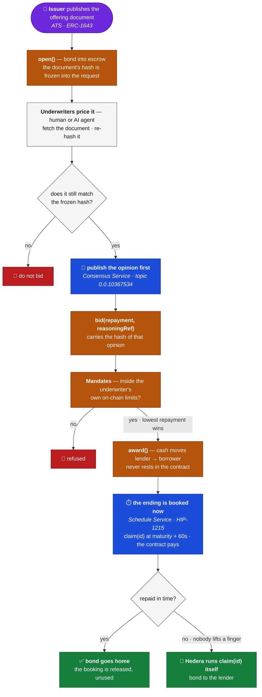
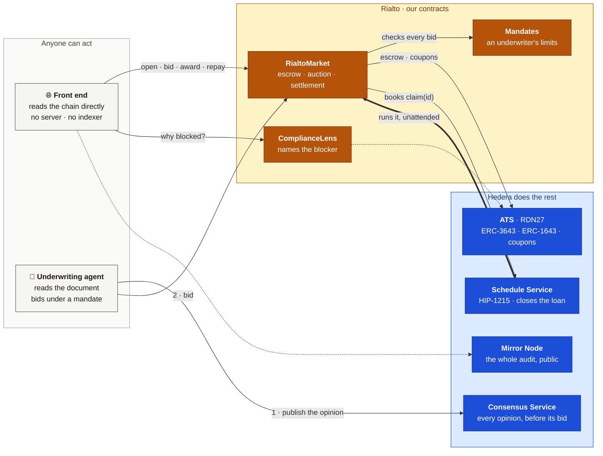

<div align="center">

# 🏛️ Rialto

### Oracle-free lending for tokenized securities, on Hedera.

**A tokenized bond has no price feed — so no lending market can take it as collateral.** Rialto is the market that doesn't need one. Underwriters read the bond's own offering document, bid a fixed repayment, and the deal is sealed at that number forever. Hedera then closes the loan itself: the reasoning behind every bid is timestamped to **HCS** before the bid lands, and `award` books a **HIP-1215** scheduled call that settles the loan at maturity with nobody watching.


🌐 **[Live app](https://hedera-rialto.vercel.app)** · 🧾 **[Deployments](DEPLOYMENTS.md)** · 📄 **[Architecture](ARCHITECTURE.md)** · ✅ **[Verify on-chain](https://hashscan.io/testnet/contract/0x9040986Da679d00F0AA93ca21E1c9Aa2143121a4)**

</div>

---

## The problem

Every lending market needs to know what your collateral is worth. So it reads a price feed.

**A bond has no feed.** There is no live market price for a single corporate note — so a lender either invents one, or refuses the asset.

Inventing one is expensive. In July 2026 a manipulated price took **$9.05M out of Bonzo Lend** and roughly **40% of Hedera's total value locked** with it. The oracle was not a detail that went wrong; it was the attack surface.

That leaves the holder of a real-world bond with two bad options: sell the asset, or don't borrow.

## What Rialto is

Rialto is a lending market with **no price feed at all.**

You lock your bond and say how much cash you want, and for how long. Underwriters — people or AI agents — read the bond's actual offering document, decide what the risk is worth, and bid a repayment. **Lowest bid wins, and that number is final.** No margin call, no liquidation, no partial outcome. Either you repay and the bond comes home, or you don't and the lender keeps it.

Three Hedera services make that safe to do without trusting anybody:

- The bond is a real **ATS** security, and its offering document is read straight off the token — hash frozen when the loan opens, so it can't be swapped underneath a bid.
- Every underwriting opinion goes to **HCS** *before* the bid it justifies, so the reasoning can't be rewritten to fit the outcome.
- `award` books a **HIP-1215** scheduled call, so a defaulted loan closes itself. No keeper, no bot, no cron.

> 🔓 **Try it** — [hedera-rialto.vercel.app](https://hedera-rialto.vercel.app). No login, no backend. Open a 12-minute loan, let the agent bid, award it, then close the tab. Come back and Hedera will have settled it without you.

## How it works

One loan, from the issuer's document to the ending the network runs by itself. Purple is Asset Tokenization Studio, **orange is our code**, **blue is Hedera doing something nobody asked it to do twice**.



- **Frozen document** — the hash is locked at `open`. Swap the file mid-auction and the bid refuses, rather than silently repricing.
- **Reasoning before the bid** — the opinion is on HCS first; the bid carries its hash.
- **Mandate on chain** — an underwriter's limits are enforced by the contract, not by the agent holding the key.
- **Cash never rests** — `award` moves it lender → borrower in a single transaction.
- **The ending is booked at the start** — nobody has to come back.

## The trust ladder

A lending market normally asks you to trust four parties. Each rung removes one.

| You'd normally trust | Rialto | Hedera primitive |
|---|---|---|
| 🔮 **A price oracle** | There is no feed. The repayment is agreed between two people. | — *nothing to manipulate* |
| 📄 **The issuer's document** | Hash frozen at `open`, re-fetched and re-hashed in your browser | **ATS** ERC-1643 |
| 🧠 **The lender's reasoning** | Published *before* the bid, hash carried on chain | **HCS** |
| 🤖 **The agent's restraint** | Limits live in a contract, not in the agent's code | `Mandates` |
| ⏱️ **A keeper bot to settle** | The network settles it. 9 loans have closed this way. | **HIP-1215** |

## Hedera, used end-to-end

Take any one of these away and the design stops working.

| Capability | What Rialto does with it | Live |
|---|---|---|
| **ATS** — ERC-3643 security | Collateral is a real permissioned token from the live ATS factory | [RDN27](https://hashscan.io/testnet/contract/0x52Ea050Fe77A303b1A61fe15d8894892aFF02114) |
| **ATS** — ERC-1643 documents | `getDocument` is the price-forming input; `open` freezes its keccak256 into the request | [`RialtoMarket.open`](src/RialtoMarket.sol) |
| **ATS** — pause · control list · KYC | `ComplianceLens` probes all three read-only and returns *which* one blocks, so the UI says it in English instead of a hex selector | [`0xd65580d3…`](https://hashscan.io/testnet/contract/0xd65580d345aE3c13Ce58586C0891b67198f23246) |
| **ATS** — corporate actions | A coupon paid to the escrow is netted off the repayment, so the borrower keeps the income on a bond they still own | [`CouponPassThrough`](src/CouponPassThrough.sol) |
| **HCS** | Every opinion timestamped before its bid; the bid stores the message's keccak256 | [topic `0.0.10367534`](https://hashscan.io/testnet/topic/0.0.10367534) |
| **HIP-1215** scheduled calls | `award` calls `scheduleCall` on `0x16b` for `claim(id)` at maturity + 60s. `payer_account_id` is the market — it funds its own ending | [schedule `0.0.10420562`](https://hashscan.io/testnet/schedule/0.0.10420562) |
| **Mirror Node** REST | The entire audit — schedules, receipts, consensus messages. No indexer, no database | [`verify-reasoning.sh`](script/verify-reasoning.sh) |

## Proven on Hedera

Read back off **testnet** on 8 September 2026 — [see the market yourself](https://hashscan.io/testnet/contract/0x9040986Da679d00F0AA93ca21E1c9Aa2143121a4).

| | |
|---|---|
| Loans run end to end | **23** — 7 repaid · 9 defaulted · 7 withdrawn |
| Principal moved | **34,000 dUSD** |
| Calls booked with Hedera | **20** — 16 settlements, 4 coupon record dates |
| ↳ **executed by the network, unattended** | **13** |
| ↳ released when the borrower repaid early | 7 |
| ↳ still pending | **0** |
| Underwriting opinions on HCS | **44** |

```bash
# count them yourself — no key, no account
curl -s "https://testnet.mirrornode.hedera.com/api/v1/schedules?account.id=0.0.10367270&limit=100&order=desc" \
  | jq '[.schedules[] | select(.payer_account_id == "0.0.10382007")]
        | {booked: length, executed: ([.[]|select(.executed_timestamp)]|length)}'
```

**The loan that closed itself.** Request #22 was awarded, then deliberately abandoned. Schedule [`0.0.10420562`](https://hashscan.io/testnet/schedule/0.0.10420562) was booked inside `award()` and ran at `1788866804.017` — **the exact second it was booked for**, calling `claim(22)`, paid for by the market contract.

**The reasoning holds.** Request #22's bid stores `0x2a91ba63…`, which is the keccak256 of [HCS message 43](https://hashscan.io/testnet/topic/0.0.10367534) — published **194 seconds before** the award. `script/verify-reasoning.sh 22` re-derives it from the public mirror node.

**The agent priced a coupon that had not been paid yet.** With the security reporting nothing about a coupon whose record date hadn't arrived, it projected **28.767123 dUSD** from the bond's terms. Hedera later recorded **28.767123 dUSD**. To the unit.

### Live contracts

| | Address | Hedera id | Source |
|---|---|---|---|
| **RialtoMarket** | [`0x9040986D…21a4`](https://hashscan.io/testnet/contract/0x9040986Da679d00F0AA93ca21E1c9Aa2143121a4) | `0.0.10382007` | ✅ verified |
| **Mandates** | [`0xb4F8cB27…47a4`](https://hashscan.io/testnet/contract/0xb4F8cB274387A5190CeF7582004558809f8547a4) | `0.0.10373522` | ✅ verified |
| **ComplianceLens** | [`0xd65580d3…3246`](https://hashscan.io/testnet/contract/0xd65580d345aE3c13Ce58586C0891b67198f23246) | `0.0.10382009` | ✅ verified |
| **Demo cash** (dUSD) | [`0x55e9BAF7…e365`](https://hashscan.io/testnet/contract/0x55e9BAF7dCFe0e2A4E51e1BdeBB4e20d6247e365) | — | ✅ verified |
| **The bond** (RDN27) | [`0x52Ea050F…2114`](https://hashscan.io/testnet/contract/0x52Ea050Fe77A303b1A61fe15d8894892aFF02114) | `0.0.10367236` | ATS proxy — not our source |
| **Reasoning topic** | [`0.0.10367534`](https://hashscan.io/testnet/topic/0.0.10367534) | — | 44 opinions |

## Architecture



The agent is optional. Its limits live in `Mandates`, on chain — so a stolen agent key still can't exceed them, and a human bidding by hand passes the identical checks.

## Tech stack

- **Contracts** — Solidity 0.8.24 · Foundry · `RialtoMarket` · `Mandates` · `ComplianceLens` · `CouponPassThrough`
- **Hedera** — ATS (ERC-3643 / ERC-1643 / corporate actions) · HCS · HIP-1215 · Mirror Node REST · HTS-aware transfers
- **Agent** — TypeScript · `@hashgraph/sdk` for HCS · viem for the EVM · Gemini or Claude reads the prospectus, deterministic fallback
- **Front end** — Next.js 15 · wagmi v2 · viem · Multicall3 batching · no backend · CSP with `frame-ancestors 'none'`
- **Quality** — 461 tests · 100% line & function coverage · `forge lint` clean

## Testing

| Suite | Tests | Covers |
|---|---|---|
| [`test/`](test/) | **243** | Contracts — unit, fuzz, [invariant](test/invariant/Invariants.t.sol), opt-in [ATS fork](test/fork/ATSFork.t.sol) |
| [`agent/test/`](agent/test/) | **139** | Document verification, [SSRF defences](agent/test/ssrf.test.ts), reasoners, coupon projection, HCS |
| [`web/test/`](web/test/) | **79** | Amount parsing, revert decoding, [URI safety](web/test/uri.test.ts), cache invalidation |

Coverage on the four production contracts — **100% of lines, 100% of functions, 98.89% of branches**:

```bash
forge coverage --no-match-coverage "(test|script|demo)"
```

The [invariant suite](test/invariant/Invariants.t.sol) drives open → bid → warp → award → repay → claim → coupon at depth 250, and asserts that escrow always equals live positions, that **the market never holds cash**, that nobody exceeds their own ceiling, and that every ending is reachable.

### Security notes

- **[`claim`](src/RialtoMarket.sol) pays the lender in storage, never the caller** — which is why it is safe to hand to the network.
- **Reentrancy** guarded on every entry point; accounting written before transfers regardless.
- **Empty returndata is only trusted from an address with code** — on Hedera a codeless address and a native HTS token both return zero bytes, and accepting that would let `award` mark a loan funded with no cash moved. Settled on-chain with [`HtsProbe`](src/demo/HtsProbe.sol).
- **A standing bid counts against the ceiling**, so twenty best bids can't each pass and breach it together.
- **Documents are fetched over http/https only**, size-capped, hashed in the browser. A `javascript:` URI is [refused](web/lib/uri.ts), not linked.

## Repository layout

```
src/               market · mandates · lens · coupon pass-through
  interfaces/      ATS · ERC-1643 · ERC-20 · Hedera Schedule Service
  demo/            NOT the protocol — demo cash, ISIN checker, two on-chain probes
agent/             the underwriting agent — reads, reasons, publishes, bids
web/               the front end — Next.js, reads the chain directly
test/              Foundry — unit · fuzz · invariant · opt-in ATS fork
script/            deploy and lifecycle drivers, plus verify-reasoning.sh
docs/              the demo bond's offering document
```

[`ARCHITECTURE.md`](ARCHITECTURE.md) — full spec, every claim with a reproduction command.
[`DEPLOYMENTS.md`](DEPLOYMENTS.md) — what is deployed, and the transactions proving each claim.
[`AI_USAGE.md`](AI_USAGE.md) — where AI was used building this, and where it was not.

## Build and run

Needs [Foundry](https://book.getfoundry.sh/getting-started/installation) and Node 20+. `forge-std` is vendored, so a plain `git clone` builds.

```bash
forge build && forge test                # 243 contract tests
cd web   && npm i && npm run dev         # the market, on :3100
cd agent && npm i && npm start           # the underwriting agent
```

<details>
<summary><b>Deploy your own</b></summary>

```bash
cp .env.example .env                     # then fill it in
node agent/scripts/fund-account.mjs <address> 5    # a fresh key has no Hedera account yet
forge script script/Deploy.s.sol --rpc-url $HEDERA_TESTNET_RPC --broadcast
npx tsx agent/scripts/create-topic.ts    # an HCS topic for the reasoning record
```

Write the addresses back into `.env`.

**Issuing the bond is different.** Anything touching ATS must go through `cast send`, not `forge script` — forge simulates locally, an ATS diamond means hundreds of `eth_getStorageAt` calls, and the mirror node times out. The exact calls are in [`DEPLOYMENTS.md`](DEPLOYMENTS.md), which also covers the two ATS APIs that are easy to get wrong: `grantKyc` takes five arguments, and freezing is `setAddressFrozen` — which leaves `isFrozen` reading **false**.

</details>

<details>
<summary><b>Drive one loan by hand</b></summary>

```bash
ID=<n> script/coupon.sh          # the manufactured payment on one request
script/verify-reasoning.sh <n>   # re-hash the HCS opinion behind a bid
cd web && npm run verify:reads   # multicall answers == individual calls
```

Everything else is in the front end. The loan-length field takes **minutes** as well as days, so a 12-minute loan can be opened, awarded, abandoned and watched closing itself without leaving the page.

</details>

## Roadmap

- **A bond somebody else issued.** RDN27 is our own ATS security. The mechanism is asset-agnostic; the next step is collateral minted by a third-party issuer through the same factory.
- **Partial fills.** One auction, one winner today. Splitting a large request across several underwriters is the natural extension and needs no new Hedera primitive.
- **Coupons for every corporate action.** Netting is wired for coupons; ATS also has redemptions and dividends, which the same pass-through covers.
- **Mainnet**, after a professional audit of `RialtoMarket`.

## Licence

[MIT](LICENSE).

<div align="center">

🌐 **[Live app](https://hedera-rialto.vercel.app)** · 🧾 **[Deployments](DEPLOYMENTS.md)** · 📄 **[Architecture](ARCHITECTURE.md)** · 🤖 **[AI usage](AI_USAGE.md)**

</div>
