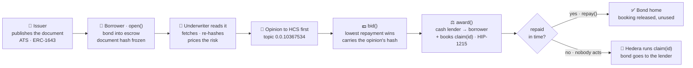
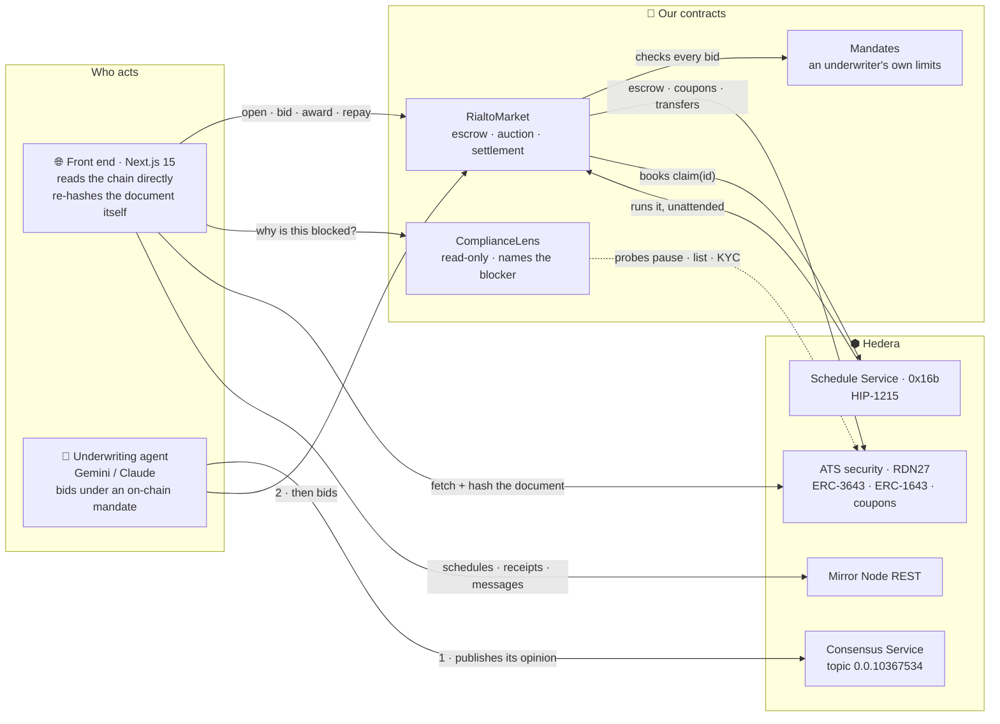

<div align="center">

# 🏛️ Rialto

### Borrow against a tokenized bond, with no price oracle anywhere.

**A bond you own is worth something, but nobody can tell you exactly what.** So Rialto never asks. Underwriters read the bond's own offering document, decide what they think it is worth, and bid a fixed repayment they are then held to. The lowest bid wins, that number never moves again, and Hedera closes the loan by itself at maturity.

*Read the document · bid a fixed repayment · the network settles it.*


🌐 **[Live app](https://hedera-rialto.vercel.app)** · 📄 **[Architecture](ARCHITECTURE.md)** · 🧾 **[Deployments](DEPLOYMENTS.md)** · ✅ **[Verify on-chain](https://hashscan.io/testnet/contract/0x9040986Da679d00F0AA93ca21E1c9Aa2143121a4)**

</div>

---

## The problem

You hold a tokenized bond. You need cash for a month. You do not want to sell it.

Every lending market answers this the same way: read a price feed, lend against it, liquidate when the number moves. That works for tokens with a deep market. **A bond does not have one.** There is no live price for a single corporate note, so there is nothing honest for a feed to say.

Building one anyway is how money gets lost. In July 2026 a manipulated price took **$9.05M out of Bonzo Lend** — and with it about **40% of Hedera's total value locked**.

So today the choice is bad: sell the asset you wanted to keep, or trust a price that does not exist.

## What Rialto is

Rialto is a lending market where **the price is a human judgement, not a feed.**

A borrower locks the bond and says how much cash they want and for how long. Underwriters — people or AI agents — read the bond's actual offering document, form a credit opinion, and bid a repayment. Lowest bid wins. That repayment is written to storage and **never changes again**.

There is no margin call, no liquidation, no partial outcome. Only two endings:

- **The borrower repays** → the bond goes home.
- **They don't** → the lender keeps the bond.

Which one happens depends on time, and on whether the money arrived. Nothing else. There is no feed to manipulate, because there is no feed.

> 🔓 **Try it** — [hedera-rialto.vercel.app](https://hedera-rialto.vercel.app) reads Hedera directly. No login, no backend. Open a **12-minute** loan, let the agent bid, award it, then close the tab. Come back and the network will have settled it without you. **The demo is the mechanism.**

## How it works



Four things in that picture are the whole design:

1. **The document hash is frozen at `open`.** An issuer who swaps the document mid-auction shows up as a mismatch instead of quietly moving a bid.
2. **The reasoning is published before the bid,** and the bid carries its hash. It cannot be rewritten to fit an outcome that did not exist yet.
3. **Cash never rests in the contract.** `award` moves it lender → borrower in one transaction.
4. **The ending is booked at the start.** Nobody has to come back.

## What you don't have to trust

A lending market normally asks you to trust four parties. Rialto removes each one, with a different Hedera primitive.

| You would normally trust… | Rialto instead | So if that party lies… |
|---|---|---|
| **A price oracle** | There isn't one. The repayment is agreed between two parties. | There is nothing to manipulate. |
| **The issuer's paperwork** | The hash is frozen at `open`; your browser re-fetches and re-hashes it. | The page says **mismatch** before you bid. |
| **The lender's reasoning** | Published to HCS *before* the bid, hash carried on chain. | The timestamps do not line up, and anyone can check. |
| **A keeper bot to settle** | `award` books a HIP-1215 call; the contract pays for it. | Nothing to fail — 9 loans have already closed this way. |

## Hedera, used end-to-end

Rialto is not an app that happens to run on Hedera. Remove any one of these and the design stops working.

| Hedera capability | How Rialto uses it |
|---|---|
| **ATS** — ERC-3643 security | The collateral is a real permissioned security minted through the live ATS factory |
| **ATS** — ERC-1643 documents | The offering document is the price-forming input. Its hash is frozen into the request |
| **ATS** — pause · control list · KYC | `ComplianceLens` reads all three and says *which* control is blocking, in plain English |
| **ATS** — corporate actions | Coupons paid to the escrow are netted off the repayment, so the borrower keeps the income |
| **HCS** (Consensus Service) | Every underwriting opinion, timestamped **before** its bid — 44 messages on `0.0.10367534` |
| **HIP-1215** scheduled calls | `award` asks the network to call `claim(id)` itself. `payer_account_id` is the contract — it funds its own ending |
| **Mirror Node** REST | The entire audit — schedules, receipts, consensus messages. No indexer, no database |

## Proven on Hedera

Every figure below was read back off **Hedera testnet** on 8 September 2026, not written down from memory.

**Loans**

| | |
|---|---|
| Run end to end | **23** |
| ↳ repaid | 7 |
| ↳ defaulted | 9 |
| ↳ withdrawn before funding | 7 |
| Principal actually moved | **34,000 dUSD** |

**Settlement, performed by the network.** Every booking has now resolved — none pending.

| | |
|---|---|
| Calls booked with Hedera | **20** |
| ↳ **executed by the network, unattended** | **13** |
| ↳ released when the borrower repaid early | 7 |
| ↳ still pending | **0** |

Of those 20: **16 are loan settlements** — 9 that the network executed on defaulted loans, 7 released when the borrower repaid early — and **4 are coupon record dates**, all four executed by the network.

```bash
# count them yourself — no key, no account
curl -s "https://testnet.mirrornode.hedera.com/api/v1/schedules?account.id=0.0.10367270&limit=100&order=desc" \
  | jq '[.schedules[] | select(.payer_account_id == "0.0.10382007")]
        | {booked: length,
           executed: ([.[] | select(.executed_timestamp)] | length),
           released: ([.[] | select(.deleted)] | length)}'
```

**One of them, in full.** Request #22 was awarded and then deliberately abandoned:

| | |
|---|---|
| Schedule | [`0.0.10420562`](https://hashscan.io/testnet/schedule/0.0.10420562) |
| Booked | `1788866025` — inside `award()` |
| Set to run at | `1788866804` — maturity + the 60s margin |
| Actually ran at | `1788866804.017150496` — **the second it was booked for** |
| The call it made | `claim(uint256)` arg `22`, to the market |
| Who paid | `0.0.10382007` — **the market contract itself** |

**The reasoning record.** Each winning bid carries the keccak256 of a consensus message published before it. Check any of them:

```
$ script/verify-reasoning.sh 22

  reasoningRef on chain   0x2a91ba639032618688cabc34888f0fd293421f6048931b938aef37ea362fdc81
  opinions on the topic   2

  sequence 44 — says bid 2000004568, hashes to 0x8e7d7623f3707fa3… (not this bid)
  MATCH — sequence 43
    388 bytes, says bid 2000002740 at 600bps
    published at consensus  1788865830.451290104
    awarded at              1788866024
    the reasoning predates the award by 194s
```

**The agent priced a coupon before it was paid.** A coupon paid to the escrow belongs to the borrower, who still owns the bond. With the security reporting *nothing* about a coupon whose record date had not arrived, the agent projected the amount from the bond's own terms and bid it into the repayment:

| | |
|---|---|
| Agent projected, before the record date | **28.767123 dUSD** |
| Hedera recorded, after it | **28.767123 dUSD** |

To the unit. Nobody intervened.

**Live contracts**

| | Address | Hedera id | Source |
|---|---|---|---|
| **Market** | [`0x9040986D…21a4`](https://hashscan.io/testnet/contract/0x9040986Da679d00F0AA93ca21E1c9Aa2143121a4) | `0.0.10382007` | ✅ verified |
| **Mandates** | [`0xb4F8cB27…47a4`](https://hashscan.io/testnet/contract/0xb4F8cB274387A5190CeF7582004558809f8547a4) | `0.0.10373522` | ✅ verified |
| **ComplianceLens** | [`0xd65580d3…3246`](https://hashscan.io/testnet/contract/0xd65580d345aE3c13Ce58586C0891b67198f23246) | `0.0.10382009` | ✅ verified |
| **Demo cash** (dUSD) | [`0x55e9BAF7…e365`](https://hashscan.io/testnet/contract/0x55e9BAF7dCFe0e2A4E51e1BdeBB4e20d6247e365) | — | ✅ verified |
| **The bond** (RDN27) | [`0x52Ea050F…2114`](https://hashscan.io/testnet/contract/0x52Ea050Fe77A303b1A61fe15d8894892aFF02114) | `0.0.10367236` | ATS diamond proxy — not our source |
| **Reasoning topic** | [`0.0.10367534`](https://hashscan.io/testnet/topic/0.0.10367534) | | 44 opinions |

## Architecture

Four contracts, an agent, and a front end that talks to the chain directly. There is no server, no indexer and no database anywhere in this system.



**The agent is optional.** It bids under a mandate its owner set on chain — biggest deal, total exposure, lowest rate, which collateral. A stolen agent key still cannot exceed those. A human bidding by hand passes exactly the same checks, and the market cannot tell them apart.

## Tech stack

- **Contracts** — Solidity 0.8.24, Foundry. `RialtoMarket` (escrow, auction, settlement, coupon netting), `Mandates`, `ComplianceLens`, `CouponPassThrough`.
- **Hedera** — ATS (ERC-3643 / ERC-1643 / corporate actions) · HCS · HIP-1215 scheduled calls · Mirror Node REST · HTS-aware transfer helpers.
- **Agent** — TypeScript, `@hashgraph/sdk` for HCS, viem for the EVM. Gemini or Claude reads the prospectus; a deterministic reader is the fallback, so the demo never depends on a network call.
- **Front end** — Next.js 15 (App Router), wagmi v2, viem. Multicall3 batching, no backend, self-hosted fonts, CSP with `frame-ancestors 'none'`.
- **Quality** — 461 tests (unit, fuzz, invariant), **100% line and function coverage** on the production contracts, `forge lint` clean.

## Testing

| Suite | Tests | Covers |
|---|---|---|
| `test/` | **243** | The contracts — unit, fuzz and invariant |
| `agent/test/` | **139** | Document verification, SSRF defences, the reasoners, coupon projection, HCS |
| `web/test/` | **79** | Amount parsing, revert decoding, URI safety, cache invalidation |

```bash
forge build && forge test               # 243
cd agent && npm install && npm test     # 139
cd web   && npm install && npm test     #  79
```

Coverage on the four production contracts:

```
| src/ComplianceLens.sol    | 100.00% (50/50)   | branches 100.00% | funcs 100.00% |
| src/CouponPassThrough.sol | 100.00% (21/21)   | branches 100.00% | funcs 100.00% |
| src/Mandates.sol          | 100.00% (25/25)   | branches 100.00% | funcs 100.00% |
| src/RialtoMarket.sol      | 100.00% (189/189) | branches  98.39% | funcs 100.00% |
|  total — lines 100.00%      statements 99.77%   branches  98.89%   funcs 100.00% |
```

The **invariant suite** is the one worth reading. It drives a handler through open → bid → warp → award → repay → claim → coupon at depth 250, and asserts — among others — that escrowed collateral always equals the sum of live positions, that **the market never holds cash**, that nobody exceeds their own ceiling, that a settled request never moves again, and that every ending is reachable.

A **fork test** runs against the live ATS deployment. It is opt-in, so the suite works offline:

```bash
FORK=1 forge test --match-path "test/fork/*" -vv
```

### Security notes

- **`claim` pays the lender recorded in storage, never the caller** — which is exactly why it is safe to hand to the network.
- **Reentrancy** is guarded on every state-changing entry point, and accounting is written before transfers regardless.
- **Empty returndata is only trusted from an address that has code.** On Hedera a call to a codeless address succeeds with zero bytes — and so does a native HTS token. Accepting that would let `award` mark a loan funded while no cash moved. Settled on-chain with `src/demo/HtsProbe.sol` rather than assumed.
- **A standing bid counts against an underwriter's ceiling**, so twenty best bids cannot each pass their own check and breach it together on award.
- **The offering document is fetched over http/https only**, size-capped, and hashed in the browser. A security pointing its document at a `javascript:` URI is refused, not rendered as a link.

## Repository layout

```
src/                  the contracts — market, mandates, lens, coupon pass-through
  interfaces/         ATS · ERC-1643 · ERC-20 · Hedera Schedule Service
  demo/               NOT the protocol — demo cash, ISIN checker, two on-chain probes
agent/                the underwriting agent — reads, reasons, publishes, bids
web/                  the market's front end — Next.js, reads the chain directly
test/                 Foundry — unit · fuzz · invariant · opt-in ATS fork
script/               deploy and lifecycle drivers, plus verify-reasoning.sh
docs/                 the demo bond's offering document
ARCHITECTURE.md       the full specification, every claim with a reproduction command
DEPLOYMENTS.md        what is deployed, and the transactions proving each claim
AI_USAGE.md           where AI was used building this, and where it was not
```

## Build and run

Needs [Foundry](https://book.getfoundry.sh/getting-started/installation) and Node 20+. `forge-std` is vendored, so a plain `git clone` builds — no `--recursive` needed.

```bash
forge build && forge test
cd web && npm install && npm run dev     # the market, on :3100
cd agent && npm install && npm start     # the underwriting agent
```

Copy `.env.example` to `.env` to run against testnet. A key that has never been used has no Hedera account yet, so fund it once — a plain value transfer cannot create one:

```bash
node agent/scripts/fund-account.mjs <address> 5
```

<details>
<summary><b>Deploying your own</b></summary>

```bash
forge script script/Deploy.s.sol --rpc-url $HEDERA_TESTNET_RPC --broadcast
npx tsx agent/scripts/create-topic.ts    # an HCS topic for the reasoning record
```

That deploys the market, the mandates registry and the lens, and creates the topic. Write the addresses back into `.env`.

**Issuing the bond is different.** Anything touching ATS must be sent with `cast send`, not `forge script`: forge simulates the body locally, an ATS diamond means hundreds of `eth_getStorageAt` calls, and the mirror node times out. `script/IssueBond.s.sol` documents the sequence; the exact calls are in `DEPLOYMENTS.md` — which also covers the two ATS APIs that are easy to get wrong (`grantKyc` takes five arguments, and freezing is `setAddressFrozen`, which leaves `isFrozen` reading **false**).

</details>

<details>
<summary><b>Driving one loan by hand</b></summary>

```bash
ID=<n> script/coupon.sh          # the manufactured payment on one request
script/verify-reasoning.sh <n>   # re-hash the HCS opinion behind a bid
cd web && npm run verify:reads   # multicall answers == individual calls
```

Everything else is reachable from the front end. The loan-length field takes **minutes** as well as days, so a twelve-minute loan can be opened, awarded, abandoned and watched closing itself without leaving the page.

</details>

## Roadmap

- **More than one instrument** — the market is asset-agnostic today; the demo runs one bond because one bond is enough to prove the mechanism.
- **A real issuer** — RDN27 is our own demo security. The next step is a bond somebody else minted through ATS.
- **Partial fills** — an auction takes one winner today. Splitting a large request across several underwriters is the natural extension.
- **Mainnet** — after a professional audit of `RialtoMarket` (testnet today).

## Licence

[MIT](LICENSE).

<div align="center">

🌐 **[Live app](https://hedera-rialto.vercel.app)** · 📄 **[Architecture](ARCHITECTURE.md)** · 🧾 **[Deployments](DEPLOYMENTS.md)** · 🤖 **[AI usage](AI_USAGE.md)**

</div>
